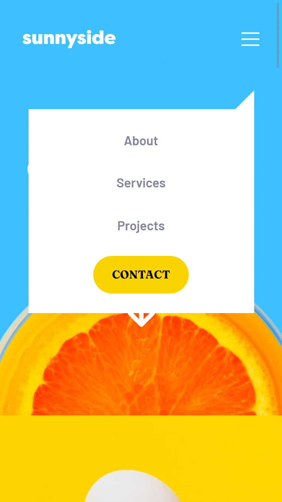
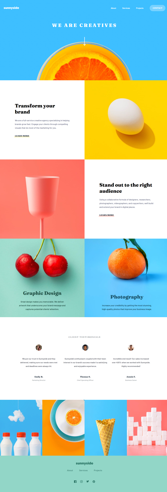

# Sunnyside Agency Landing Page Solution

This is a solution to the [Sunnyside agency landing page challenge on Frontend Mentor](https://www.frontendmentor.io/challenges/sunnyside-agency-landing-page-7yVs3B6ef).

## The challenge

Users should be able to:

- View the optimal layout for the site depending on their device's screen size
- See hover states for all interactive elements on the page

[🔗 Live Demo](https://gabrielli-lima.github.io/Sunnyside-agency-landing-page/)

## Screenshots

### Mobile version

### Desktop version

## Built with

- Semantic HTML5 markup
- CSS custom properties
- Flexbox
- CSS Grid
- Mobile-first workflow
- Responsive design
- JavaScript